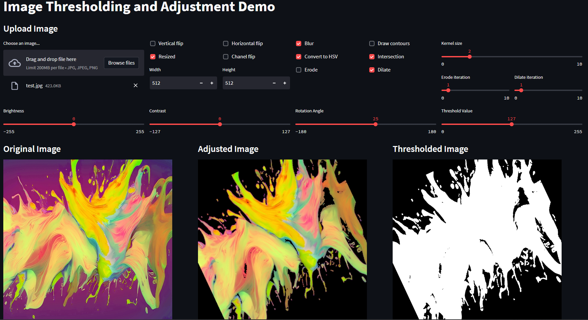

# [Streamlit-practice](https://li-syuan-streamlit-practice-first-app-tr6k6q.streamlit.app/)
**Image thresholding** separates image pixels into two groups based on intensity values, allowing objects of interest to be isolated from the background.
**Image adjustment** manipulates intensity values, improving overall image quality or preparing it for further processing. Common adjustments include brightness and contrast,... etc.
### Demo
